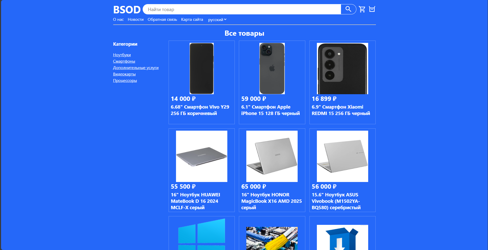
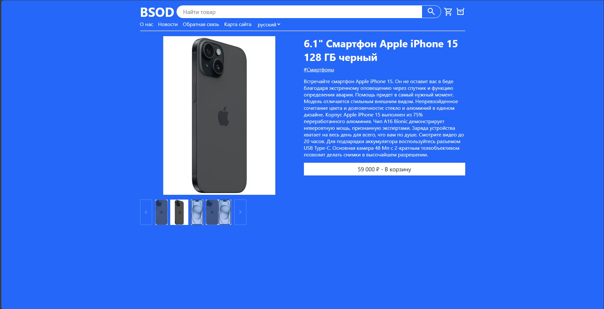
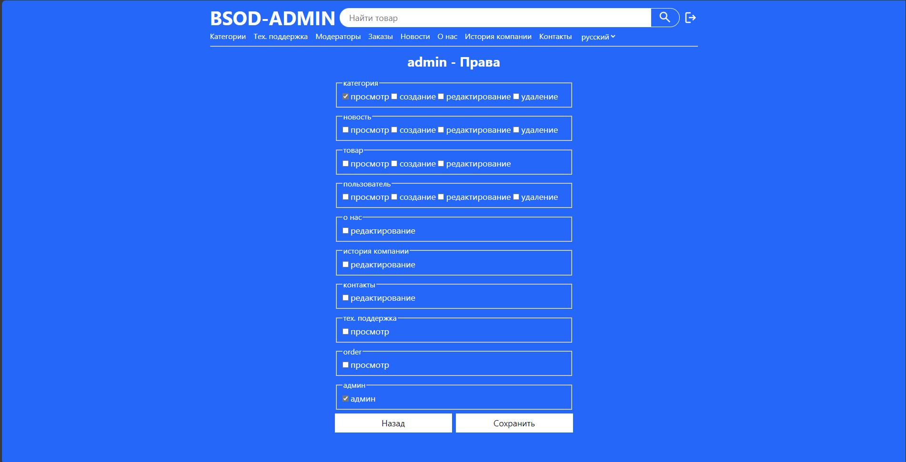

# BSOD Computer Store

Веб-приложение для интернет-магазина компьютерной техники. Реализована пользовательская часть (каталог, корзина, заказы, отзывы, поддержка) и административная панель с управлением товарами, категориями, заказами, контентом и правами пользователей.

## Стек технологий

- **Backend:** ASP.NET Core MVC 8.0 / 9.0, C#
- **Database:** PostgreSQL + Entity Framework Core (Code First)
- **Frontend:** HTML5, CSS3 (адаптивная вёрстка), jQuery
- **Localization:** .resx + IViewLocalizer (русский / английский)
- **Authentication:** Cookie-based, роли + кастомные права (user privileges)
- **Version control:** Git + GitHub

## Скриншоты

- Главная страница магазина  
  

- Страница товара с галереей  
  

- Админка – редактирование пользователя и прав  
  

## P.S.
Проект создан в рамках дисциплины "Веб-технологии" Севастопольского государственного университета, 2026